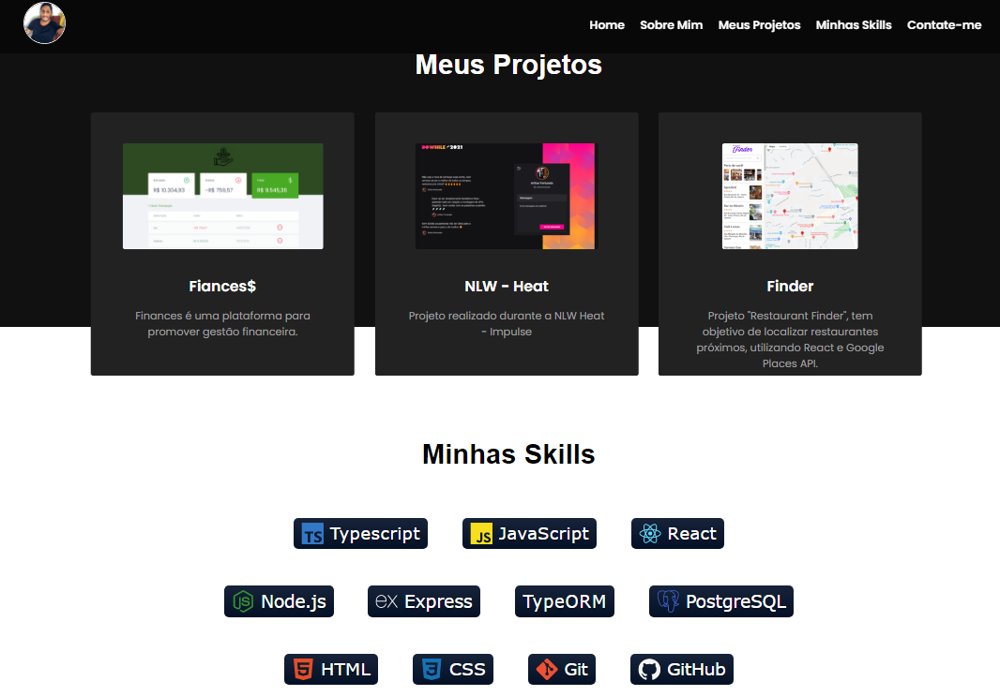

<p align="center">
     
</p>

<h1 align="center">
    
</h1>

<br>

## 💻 Projeto

Tem o objetivo de mostrar meus projetos e currículo .


## 🧪 Tecnologias

Esse projeto foi desenvolvido com as seguintes tecnologias:

- [JS](https://www.javascript.com/)
- [HTML](https://firebase.google.com/)
- [CSS](https://www.typescriptlang.org/)

## 🚀 Como executar

Clone o projeto e acesse a pasta do mesmo.

```bash
$ git clone https://github.com/arthurfortunato/meu-portfolio.git
$ cd meu-portfolio
```

Para iniciá-lo, siga os passos abaixo:
```bash
# Iniciar o projeto
Open with Live Server

---